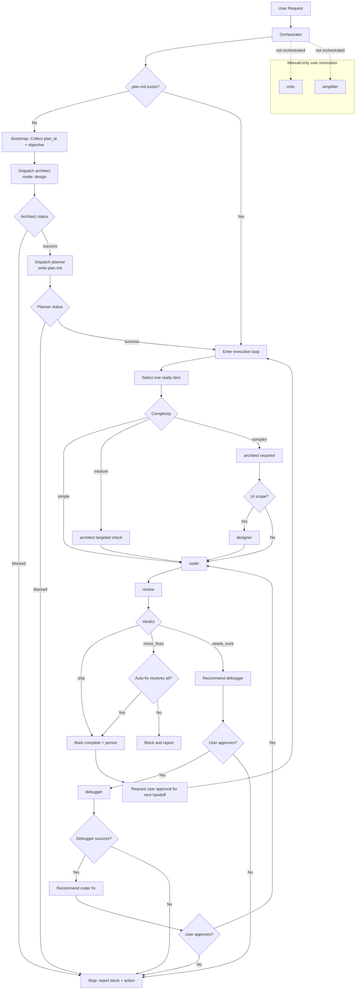

# CopilotAgents

Orchestrator-driven multi-agent workflow for Copilot Chat. The orchestrator runs one plan item at a time, validates strict output contracts, and hands control back to the user between stages.

## Overview

This repository defines a deterministic agent system with:
- Sequential execution from a persisted plan file at `/plans/{plan_id}/plan.md`
- Complexity-based routing (`simple`, `medium`, `complex`)
- Contract + signature validation on every subagent response
- Explicit human approval between dispatches
- Manual-only specialist agents outside the orchestrated loop

## Agent Roster

| Agent | Role | Model | User-Invocable | Signature |
|---|---|---|---|---|
| `orchestrator` | Sequential coordinator; dispatch + contract validation | `reasoning-large` | yes | n/a (coordinator) |
| `architect` | Design constraints and architecture validation | `reasoning-large` | no | `CEDAR_COMPASS` |
| `planner` | Plan decomposition and dependency-safe roadmap | `reasoning-fast` | no | `IRON_ATLAS` |
| `coder` | Implementation agent for features/fixes/refactors | `code-tuned` | yes | `NOVA_CORE` |
| `review` | Verification gate: lint/typecheck/build + quality/security review | `reasoning-fast` | no | `SILVER_KITE` |
| `debugger` | Root-cause isolation and corrective guidance | `reasoning-fast` | no | `EMBER_TRACE` |
| `designer` | UI/UX specification and validation | `reasoning-large` | no | `AURORA_GRID` |
| `critic` | Deep analysis specialist (manual-only) | varies by file | yes (manual) | `AMBER_LENS` |
| `simplifier` | Behavior-preserving refactoring specialist (manual-only) | `code-tuned` | yes (manual) | `CLEAR_STREAM` |

## How to Start

### Bootstrap flow
Use when `/plans/{plan_id}/plan.md` does not exist:
1. Collect `plan_id` and objective (via `vscode/askQuestions` if missing).
2. Create `/plans/{plan_id}/` placeholder.
3. Dispatch `architect` in `design` mode.
4. If architect returns `success`, dispatch `planner` with design path + constraints.
5. If planner returns `success`, enter normal execution loop from first `ready` item.
6. If any bootstrap stage returns `blocked`, stop and report reason + recommended action.

Bootstrap is outside loop iteration counting. Each bootstrap dispatch still requires user approval before continuing.

### Resume flow (existing plan)
1. Read `/plans/{plan_id}/plan.md`.
2. Select exactly one `ready` item with satisfied dependencies.
3. Mark `in_progress`, dispatch one downstream stage, validate contract/signature, persist outcome.
4. Stop for explicit user approval before the next dispatch.

## Complexity Routing

| Complexity | Dispatch Pipeline |
|---|---|
| `simple` | `coder` -> `review` |
| `medium` | `architect` (targeted constraints check if needed) -> `coder` -> `review` |
| `complex` | `architect` (required) -> `designer` (if UI scope exists) -> `coder` -> `review` |

Additional routing rules:
- If `review` returns `needs_work` and cannot auto-fix, handoff recommendation is `debugger` (user-approved).
- If `debugger` succeeds, handoff recommendation is `coder` for fix implementation (user-approved).

## Contract Protocol

Every orchestrated subagent response must end with:

```markdown
### Orchestrator Contract
- Status: `success` | `blocked`
- Evidence: [concise factual bullets]
- Next Steps: [recommended downstream handoff or user action]
- Agent Signature: <SIGNED_VALUE>
```

Agent-specific required fields:
- `review`: include `Verdict: ship | minor_fixes | needs_work`, plus `Failures` when present.
- `debugger`: include `Attempt` and `Attempts Remaining`.
- `planner`: include itemized roadmap entries with complexity/dependencies.

Fail-closed behavior:
- Missing contract block, missing/mismatched signature, malformed required fields, or blocking verdict causes immediate block and stop.

## Review Verdict Semantics

`review` maps outcomes to:
- `ship`: all required checks pass; no unresolved critical issues
- `minor_fixes`: non-critical issues remain
- `needs_work`: critical failures or unresolved verification failures

Auto-fix upgrade rule:
- If all `minor_fixes` findings are resolved by deterministic auto-fix and re-checks pass, `review` upgrades verdict to `ship` before returning the contract.
- `minor_fixes` is returned only when at least one issue could not be auto-fixed.

## Manual-Only Agents

`critic` and `simplifier` are user-invocable only and not part of orchestrator-managed pipelines.
- They are excluded from orchestrator dispatch roster.
- They must not be assigned as `owner_agent` in planner roadmap items.
- Use them only when explicitly requested by the user.

## Skills Awareness

`architect` and `coder` support optional Copilot Chat skill/participant enrichment:
- Detect stack signals in workspace (`.sln`, `.csproj`, `angular.json`, `package.json`, lockfiles, cloud configs).
- If a relevant participant exists (for example `@azure`, `@dotnet`, `@angular`), consult it for stack-specific constraints/patterns.
- If unavailable, proceed immediately; skill usage is optional and never blocking.
- `architect` records consulted skills in `/plans/{plan_id}/design.md`.

## Schematic Flow

```text
User Request
   |
   v
Orchestrator
   |
   +-- if no /plans/{plan_id}/plan.md --> BOOTSTRAP
   |         1) architect (design)
   |         2) planner (plan.md)
   |         3) enter loop
   |
   +-- if plan exists ------------------> EXECUTION LOOP
             select one ready item
             route by complexity
             validate contract + signature
             persist status
             stop for user approval

Per-item pipelines:
- simple:  coder -> review
- medium:  architect -> coder -> review
- complex: architect -> designer -> coder -> review

Review outcomes:
- ship: complete item
- minor_fixes: auto-fix/re-check inside review; if fully resolved => ship
- needs_work: recommend debugger -> coder fix path (user-approved)

Manual-only:
- critic, simplifier are invoked directly by user, never auto-dispatched
```

## Mermaid Diagram


